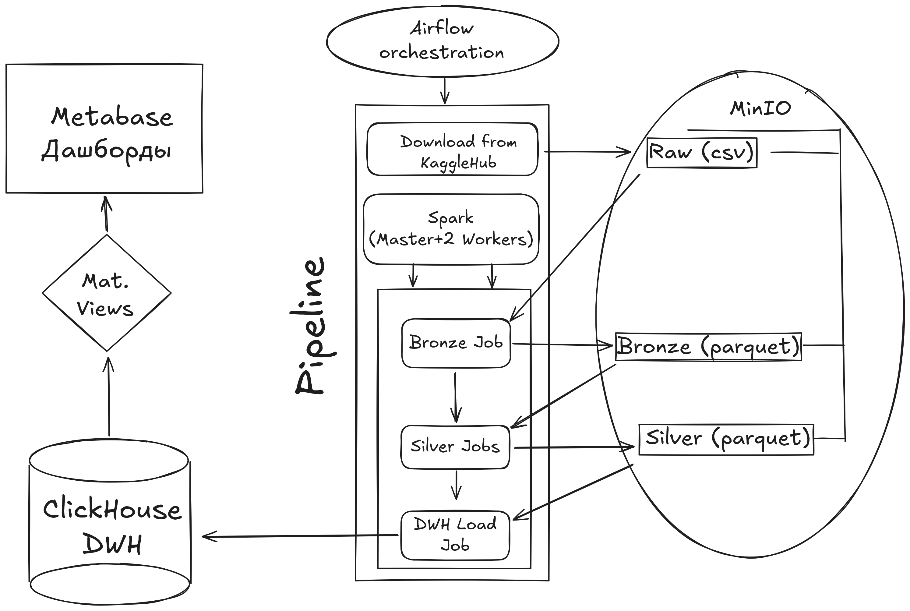

# Проект платформы обработки данных (Data Platform) для e-commerce аналитики

## Основные цели данного проекта

1) Создание end2end аналитической платформы, имеющей DWH-архитектуру.

2) Создание ETL-процесса, реализующего медальонную структуру обработки данных.

3) Создание аналитических отчетов.

4) Оркестрация пайплайна в Airflow.

5) Распределенная обработка данных на 2 нодах Spark.

6) Создание аналитических дашбордов на BI-платформе.

## Описание проекта

Пайплайн автоматически:

- загружает сырые данные с kagglehub

- очищает и трансформирует их

- строит star schema

- формирует аналитические витрины

- визуализирует метрики в Metabase

### Используется медальонная архитектура (Bronze -> Silver -> DWH (ClickHouse) -> Витрины (мат. представления в ClickHouse))

Raw Data (загрузка с KaggleHub) 
   │  
   ▼  
Bronze Layer (без обработки)  
   │  
   ▼  
Silver Layer (очистка данных)   
   │  
   ▼  
Star Schema (ClickHouse DWH)  
   │  
   ▼  
Витрины (Materialized Views в ClickHouse)  
   │  
   ▼  
BI Dashboard (Metabase)  

### Используемые в проекте технологии

| Задача            | Технология             |
| ------------------| -----------------------|
| Оркестрация       | Airflow                |
| Предобработка     | Spark                  |
| Хранилище         | MinIO (S3 совместимое) |
| Data Warehouse    | ClickHouse             |
| BI                | Metabase               |
| Инфраструктура    | Docker Compose         |
| Язык              | Python                 |

## Архитектура

### Bronze Layer

Загрузка необработанных данных.

Исходные файлы загружаются посредством PySpark в MinIO в .parquet формате.

Исходный код задачи: jobs/bronze_jobs/bronze_job.py.

### Silver Layer

На этом этапе происходит очистка (дедупликация, поиск выбросов) и нормализация данных (приведение типов).

Обрабатываемые таблицы:

* customers

* sellers

* products

* orders

* order_items

* payments

* reviews

* geolocation

Обработанные данные загружаются посредством PySpark в MinIO в .parquet формате. Используется партиционирование на основе даты и номера загрузки.

Spark jobs: jobs/silver_jobs/

Все записи с выбросами (например, отрицательные цены или нереалистичные географические координаты) помещаются в Quarantine Layer. В данном датасете таких записей не обнаружено, поэтому слой пуст.

### Data Warehouse (Star Schema)

В качестве DWH выбран ClickHouse. 
Само хранилище организовано по Star Schema:

1) Фактовые таблицы:

- fact_orders (данные по заказу целиком)
- fact_order_items (данные по каждому товару в заказе)

Обоснование создания двух фактовых таблиц: в датасете Olist одному заказу может принадлежать более одного товара. При этом оценка заказа и оплата товара покупателем дается на весь заказ целиком. Поэтому необходимо сделать две отдельные таблицы. 

2) Таблицы измерений

- dim_customer (уникальные идентификаторы пользователя)
- dim_seller (информация о продавцах)
- dim_product (информация о товарах)
- dim_location (города и штаты)
- dim_delivery (время заказа, время доставки, прогнозируемое время доставки и т.д.)
- dim_reviews (оценки по заказам)

Схема в ClickHouse: clickhouse-schema/star-schema.
Spark job: jobs/create_star/star.py

### Витрины данных

- sales_daily

- customer_metrics

- seller_metrics

- product_metrics

- city_metrics

- cohort

SQL definitions: clickhouse-schema/views.

Данные представления используются для BI аналитики.

### Оркестрация

Для оркестрации пайплайна используется Apache Airflow.

Airflow DAG: airflow/dags/master_dag.py

Структура пайплайна:
1) Загрузка с KaggleHub (BashOperator)
2) Создание Bronze Layer (SparkSubmitOperator)
3) Создание Silver Layer (SparkSubmitOperator. Обработка каждой из таблиц происходит отдельно, задачи объединены через TaskGroup)
4) Заполнение DWH (SparkSubmitOperator)

**Все этапы пайплайна логируются.** См. jobs-logs/. Логи самого Airflow доступны по пути airflow/airflow-logs.

## Структура проекта

.  
├── airflow  
│   ├── dags  
│   │   ├── first_dag.py  
│   │   ├── another.py  
│   │   └── master_dag.py  
│   |  
├── jobs  
│   ├── bronze_jobs  
│   │   └── bronze_job.py  
│   │   
│   ├── silver_jobs  
│   │   ├── customers.py  
│   │   ├── orders.py  
│   │   ├── items.py  
│   │   ├── products.py  
│   │   ├── sellers.py  
│   │   ├── payments.py  
│   │   ├── reviews.py  
│   │   └── geolocation.py  
│   │  
│   ├── create_star  
│   │   └── star.py  
│   │  
│   └── marts_jobs  
│  
├── clickhouse-schema  
│   ├── star-schema  
│   └── views  
│  
├── spark  
│   └── Dockerfile  
│  
├── metabase  
│
├── jars  
│
└── docker-compose.yml  

## Запуск проекта

1) git clone https://github.com/ivantozavr0/olist_ETL.git
2) cd olist_ETL
3) docker-compose up -d

Будут запущены следующие сервисы:
- Spark (master + 2 workers)
- Airflow 
- MinIO
- Metabase 

4) Откройте Airflow http://localhost:8085 (откроется не сразу необходимо подождать окончания настройки) и **запустите задачи master_dag**. Логин: admin, пароль: admin.

5) Откройте Metabase http://localhost:3000. 
Логин: example@mail.com, пароль: metabase1.  

**Пройдите по пути "Коллекции" -> "Ваша личная коллекция" -> "Метрики Olist".**

6) Интерфейс ClickHouse доступен по адресу http://localhost:8123.

7) Интерфейс MinIO доступен по адресу http://localhost:9001.

## Примеры работы программы

<скриншоты airflow и дашбордов Metabase>

## Dataset

Проект использует Olist E-commerce dataset.

Источник:
<https://www.kaggle.com/datasets/olistbr/brazilian-ecommerce>

# License 

MIT License

