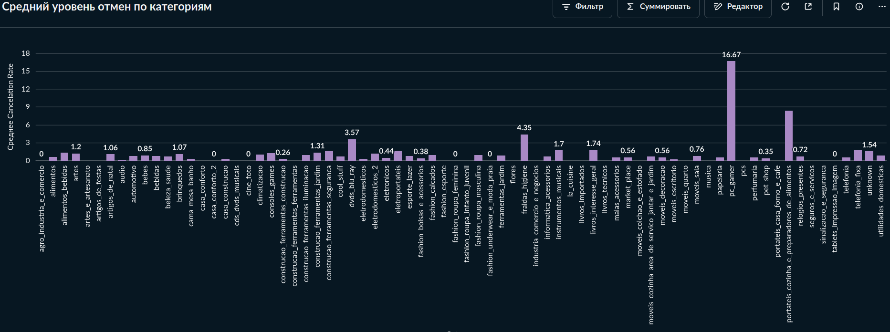
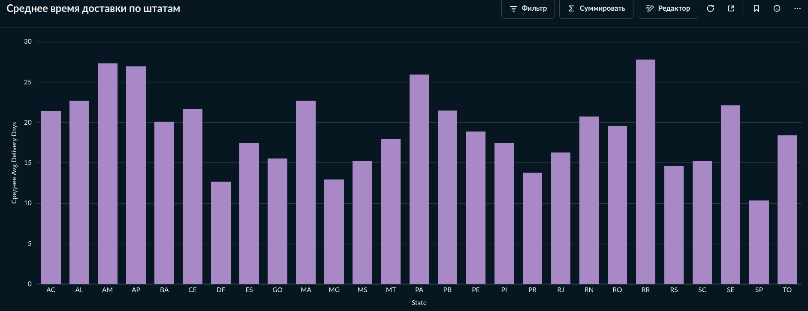
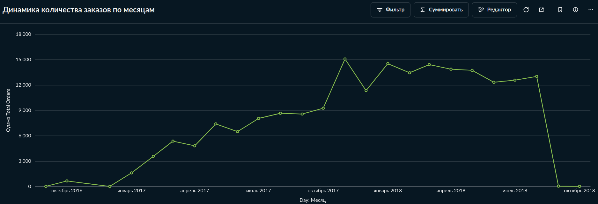
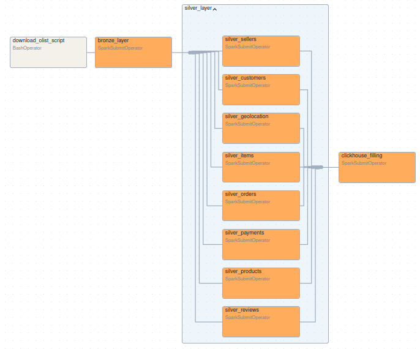
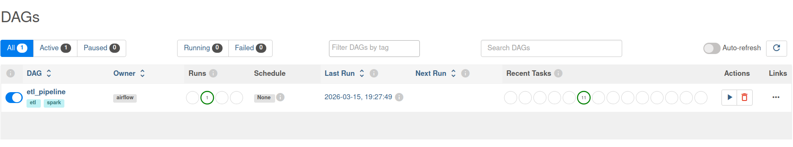

# Проект платформы обработки данных (Data Platform) для e-commerce аналитики

## Ключевые особенности проекта

- Реализован end2end пайплайн обработки данных

- ETL-процесс имеет медальонную структуру

- Используются распределенные вычисления на Spark кластере (2 workers)

- В проекте используется ClickHouse DWH

- Для промежуточных этапов обработки данных используется S3-совместимое хранилище MinIO.

- Созданы аналитические витрины в виде ClickHouse Materialized Views

- Созданы аналитические дашборды на BI-платформе Metabase

- Вся инфраструктура проекта развернута в контейнерах. Проект собирается через docker compose.

## Описание проекта

### Используемые в проекте технологии

| Задача            | Технология             |
| ------------------| -----------------------|
| Оркестрация       | Airflow                |
| Вычисления        | Spark                  |
| Хранилище         | MinIO (S3 совместимое) |
| Data Warehouse    | ClickHouse             |
| BI                | Metabase               |
| Инфраструктура    | Docker Compose         |
| Язык              | Python                 |

## Архитектура

### Используется медальонная архитектура (Bronze -> Silver -> DWH (ClickHouse) -> Витрины (мат. представления в ClickHouse))

Архитектурная схема

Пайплайн автоматически:

- загружает сырые данные с kagglehub

- очищает и трансформирует их

- строит star schema

- формирует аналитические витрины

- визуализирует метрики в Metabase

### Bronze Layer

Загрузка необработанных данных.

Исходные файлы загружаются посредством PySpark в MinIO в .parquet формате.

Исходный код задачи: jobs/bronze_jobs/bronze_job.py.

### Silver Layer

На этом этапе происходит очистка (дедупликация, поиск выбросов) и нормализация данных (приведение типов).

Обрабатываемые таблицы:

* customers

* sellers

* products

* orders

* order_items

* payments

* reviews

* geolocation

Обработанные данные загружаются посредством PySpark в MinIO в .parquet формате. Используется партиционирование на основе даты и номера загрузки.

Spark jobs: jobs/silver_jobs/

Все записи с выбросами (например, отрицательные цены или нереалистичные географические координаты) помещаются в Quarantine Layer. В данном датасете таких записей не обнаружено, поэтому слой пуст.

### Data Warehouse (Star Schema)

В качестве DWH выбран ClickHouse. 
Само хранилище организовано по Star Schema:

**1) Фактовые таблицы**

- fact_orders (данные по заказу целиком)

- fact_order_items (данные по каждому товару в заказе)

Обоснование создания двух фактовых таблиц: в датасете Olist одному заказу может принадлежать более одного товара. При этом оценка заказа и оплата товара покупателем дается на весь заказ целиком. Поэтому необходимо сделать две отдельные таблицы. 

**2) Таблицы измерений**

- dim_customer (уникальные идентификаторы пользователя)

- dim_seller (информация о продавцах)

- dim_product (информация о товарах)

- dim_location (города и штаты)

- dim_delivery (время заказа, время доставки, прогнозируемое время доставки и т.д.)

- dim_reviews (оценки по заказам)

Схема в ClickHouse: clickhouse-schema/star-schema.
Spark job: jobs/create_star/star.py

### Витрины данных

**1) mv_sales_daily:**

- day

- total_orders: количество заказов в данный день

- orders_delivered: количество доставленных заказов среди заказанных в этот день

- total_payments: суммарный платеж по всем успешным в этот день заказам

- avg_payments: средний чек в этот день

- avg_review: средняя оценка заказов в данный день

- items_per_order: сколько товаров покупали в среднем в одном заказе

**2) mv_seller_metrics:**

- seller_id

- items_ordered: суммарное количество заказанных товаров

- items_sold: суммарное количество успешно доставленных товаров

- cancellation_rate: процент отмененных заказов

- total_revenue: суммарная выручка продавца

- avg_revenue: средняя выручка продавца за один заказ

- avg_review_score: средний рейтинг продавца по отзывам (учтено, что в одном заказе может быть несколько разных продавцов, а оценка ставится на весь заказ. Поэтому в расчете используются лишь такие заказы, в которых данный продавец - единственный)

- avg_delivery_days: среднее время доставки товаров данного подавца в днях

**3) mv_customer_metrics:**

- customer_unique_id: уникальный id конкретного пользователя

- total_orders: всего заказов сделано

- total_spent: всего денег потрачено

- avg_order_value: средняя стоимость заказа

- first_purchase_date: время первого заказа

- last_purchase_date: время последнего заказа

- lifetime_days: количество дней между первым и последним заказом

- avg_review_score: средняя оценка данного пользователя

Учтена особенность датасета, что есть уникальный id customer_unique_id и id заказчика данного заказа customer_id.

**4) mv_product_metrics:**

- product_id

- total_orders: количество заказов данного товара

- cancelation_rate: процент отмененных заказов с данным товаром

- total_revenue: сумма, потраченная на этот товар за все время. Учитываются только доставленные заказы.

- avg_price: средняя цена товара за все время

- avg_review_score: средняя оценка данного товара (Учтено, что в одном заказе может быть несколько разных товаров, а оценка ставится на весь заказ. Поэтому в расчете используются лишь такие заказы, в которых данный товар - единственный)

- category: категория данного товара

**5) mv_city_metrics:**

- city: город

- state: штат

- total_orders: заказов из данного города

- total_payments: суммарная оплата доставленных в этот город заказов

- avg_payments: средняя цена доставленных в этот город заказов

- total_customers: суммарное количество уникальных покупателей из этого города

- avg_review_score: средняя оценка заказов из этого города

- avg_delivery_days: среднее время доставки в этот город в днях

- median_delivery_days: медианное время доставки в этот город в днях

- late_delivery_rate: количество не доставленных вовремя заказов в данный город

**6) mv_cohort:**

- month: месяц конкретного года

- months_passed: количество месяцев, прошедшее с начального месяца когорты month

- active_users: количество активных пользователей из когорты спустя months_passed

- cohort_size: размер когорты

- retention_rate: количество пользователей когорты, активных спустя months_passed месяцев

SQL definitions: clickhouse-schema/views.

Данные представления используются для BI аналитики.

#### Примеры дашбордов на основе данных витрин

1) Процент отказов по категориям товаров:

 
2) Среднее время доставки заказов по штатам:

3) Динамика заказов по месяцам

### Оркестрация

Для оркестрации пайплайна используется Apache Airflow.

Airflow DAG: airflow/dags/master_dag.py

Структура пайплайна:
1) Загрузка с KaggleHub (BashOperator)
2) Создание Bronze Layer (SparkSubmitOperator)
3) Создание Silver Layer (SparkSubmitOperator. Обработка каждой из таблиц происходит отдельно, задачи объединены через TaskGroup)
4) Заполнение DWH (SparkSubmitOperator)

**Все этапы пайплайна логируются.** См. jobs-logs/. Логи самого Airflow доступны по пути airflow/airflow-logs.

DAG

Пример удачно отработавшего DAG

## Запуск проекта

1) git clone https://github.com/ivantozavr0/olist_ETL.git
2) cd olist_ETL
3) docker-compose up -d

Будут запущены следующие сервисы:
- Spark (master + 2 workers)
- Airflow 
- MinIO
- Metabase 

4) Откройте Airflow http://localhost:8085 (откроется не сразу необходимо подождать окончания настройки) и **запустите задачи master_dag**. Логин: admin, пароль: admin.

5) Откройте Metabase http://localhost:3000. 
Логин: example@mail.com, пароль: metabase1

**Пройдите по пути "Коллекции" -> "Ваша личная коллекция" -> "Метрики Olist".**

6) Интерфейс ClickHouse доступен по адресу http://localhost:8123.

7) Интерфейс MinIO доступен по адресу http://localhost:9001.

## Структура проекта

.  
├── airflow  
│   ├── dags  
│   │   ├── first_dag.py  
│   │   ├── another.py  
│   │   └── master_dag.py  
│   |  
├── jobs  
│   ├── bronze_jobs  
│   │   └── bronze_job.py  
│   │   
│   ├── silver_jobs  
│   │   ├── customers.py  
│   │   ├── orders.py  
│   │   ├── items.py  
│   │   ├── products.py  
│   │   ├── sellers.py  
│   │   ├── payments.py  
│   │   ├── reviews.py  
│   │   └── geolocation.py  
│   │  
│   ├── create_star  
│   │   └── star.py  
│   │  
│   └── marts_jobs  
│  
├── clickhouse-schema  
│   ├── star-schema  
│   └── views  
│  
├── spark  
│   └── Dockerfile  
│  
├── metabase  
│
├── jars  
│
└── docker-compose.yml  

## Примеры работы программы

<скриншоты airflow и дашбордов Metabase>

## Dataset

Проект использует Olist E-commerce dataset.

Источник:
<https://www.kaggle.com/datasets/olistbr/brazilian-ecommerce>

# License 

MIT License

